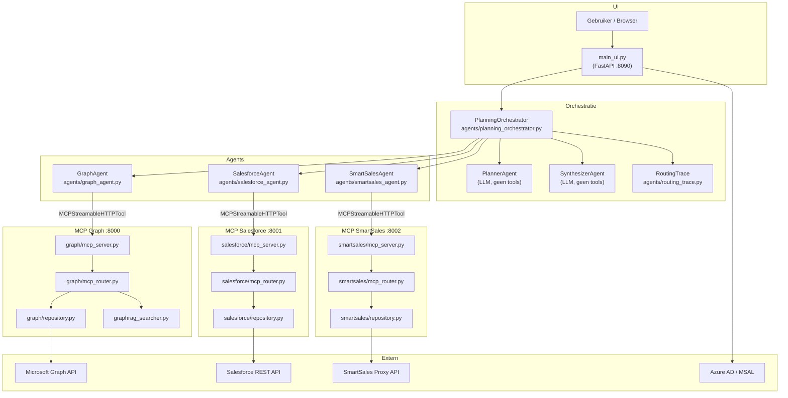

# Analysis 01 — High-level architectuuroverzicht

## 1. Hoofdcomponenten en bestandsreferenties

### Startpunt en UI-laag

| Bestand | Rol |
|---|---|
| `main_ui.py` | FastAPI-server op poort 8090; multi-turn chat via SSE; orchestreert opstarten en sessionbeheer |
| `startup.py` | Gedeelde helpers voor authenticatie, MCP-serverprocessen starten, sessietokens ophalen |
| `ui/index.html` | Frontend HTML-interface |

### Orchestratielaag

| Bestand | Rol |
|---|---|
| `agents/planning_orchestrator.py` | `PlanningOrchestrator` klasse: plan → DAG-executie → synthese |
| `agents/routing_trace.py` | `RoutingTrace`, `AgentInvocation`, `ContextVar`-gebaseerde trace per aanvraag |

### Gespecialiseerde agents

| Bestand | Rol |
|---|---|
| `agents/graph_agent.py` | Factory `create_graph_agent()` — Agent met MS365-tools |
| `agents/salesforce_agent.py` | Factory `create_salesforce_agent()` — Agent met Salesforce CRM-tools |
| `agents/smartsales_agent.py` | Factory `create_smartsales_agent()` — Agent met SmartSales-tools |

### MCP-serverlaag (per domein)

| Module | MCP-server bestand | Poort |
|---|---|---|
| Microsoft Graph / MS365 | `graph/mcp_server.py` | 8000 |
| Salesforce CRM | `salesforce/mcp_server.py` | 8001 |
| SmartSales | `smartsales/mcp_server.py` | 8002 |

### Tool-registratielaag (mcp_router)

| Bestand | Rol |
|---|---|
| `graph/mcp_router.py` | Laadt `graph/tools.yaml`, bouwt dynamische handler-signaturen, registreert tools bij FastMCP |
| `salesforce/mcp_router.py` | Analoog voor Salesforce tools |
| `smartsales/mcp_router.py` | Analoog voor SmartSales tools |

### Repository/service-lagen

| Bestand | Rol |
|---|---|
| `graph/repository.py` | `GraphRepository` — async calls naar Microsoft Graph SDK |
| `salesforce/repository.py` | `SalesforceRepository` — SOQL queries via httpx |
| `smartsales/repository.py` | SmartSales REST API calls via httpx |

### Modellen

| Bestand | Rol |
|---|---|
| `graph/models.py` | Pydantic-modellen: `Email`, `File`, `Contact`, `CalendarEvent`, `User`, `SearchResult` |
| `salesforce/models.py` | Pydantic-modellen: `SalesforceAccount`, `SalesforceContact`, `SalesforceOpportunity`, `SalesforceCase`, `SalesforceLead` |
| `smartsales/models.py` | SmartSales-datamodellen (locaties, catalogusitems, bestellingen) |

### Authenticatie en tokenbeheer

| Bestand | Rol |
|---|---|
| `graph/mcp_server.py` | OAuth2 Authorization Code Flow proxy + OBO-token-uitwisseling voor Graph |
| `salesforce/auth.py` | OAuth2 Authorization Code Flow + JWT Bearer Flow helpers |
| `salesforce/token_store.py` | `JsonFileTokenStore` (dev) / `AzureKeyVaultTokenStore` (prod) |
| `salesforce/mcp_server.py` | Salesforce OAuth routes, sessieresolutie |
| `smartsales/auth.py` | Client credentials flow naar SmartSales proxy |
| `smartsales/token_store.py` | Analoog aan Salesforce token_store |
| `startup.py` | MSAL-gebaseerde Microsoft login, sessieresolutie helpers |
| `shared/mcp_utils.py` | `extract_session_token()` — token uit Authorization-header |

### GraphRAG (documentzoekmachine)

| Bestand | Rol |
|---|---|
| `graph/graphrag_searcher.py` | Vector RAG via LanceDB; embed query → top-5 chunks → LLM-call |
| `graph/graphrag_indexer.py` | Indexeert OneDrive-documenten via GraphRAG 3.0.9 |
| `graph/graphrag/settings.yaml` | GraphRAG-configuratie |
| `graph/context.py` | `DocumentContextProvider` — injecteert sessiecontext voor bestandstools |

### Evaluatie

| Bestand | Rol |
|---|---|
| `eval/script.py` | Volledig benchmarksysteem → `benchmark_results.xlsx` |
| `eval/score.py` | LLM-as-a-Judge scorer voor antwoordkwaliteit en routing |
| `eval/mlflow_eval.py` | MLflow-gebaseerde benchmark met metriekverzameling |
| `eval/mlflow_tracing.py` | Monkey-patching van orchestrator voor MLflow spans |
| `eval/prompts/prompts.json` | Benchmarkprompts met `expected_agents` en `expected_answer` |

---

## 2. Samenhang van componenten

Het systeem bestaat uit vier conceptuele lagen die verticaal per databron lopen en horizontaal via de orchestrator worden verbonden.

### Verticale domeinlaag (per databron)

Elke databron heeft een identieke structuur:

```
tools.yaml → mcp_router.py → mcp_server.py (FastMCP)
                                     ↓
                              repository.py (API-client)
                                     ↓
                              models.py (Pydantic)
```

De `mcp_router.py` laadt de YAML-definities, bouwt Python-signaturen dynamisch op met `inspect.Signature`, en registreert elke handler bij de FastMCP-instantie. De MCP-server biedt de tools aan via HTTP op een vaste poort. De repository voert de daadwerkelijke API-aanroepen uit en geeft Pydantic-modellen terug.

### Horizontale orchestratielaag

De `PlanningOrchestrator` (`agents/planning_orchestrator.py`) ontvangt een gebruikersvraag en voert drie fasen uit:

1. **Planfase**: Een `PlannerAgent` (Agent zonder tools, alleen prompt) genereert een JSON-plan met stappen en afhankelijkheden.
2. **Uitvoeringsfase**: De stappen worden als een DAG geordend en per wave parallel uitgevoerd. Elke stap roept een gespecialiseerde subagent aan.
3. **Synthesefase**: Een `SynthesizerAgent` (Agent zonder tools) combineert alle resultaten tot een eindantwoord.

De gespecialiseerde agents (`GraphAgent`, `SalesforceAgent`, `SmartSalesAgent`) zijn elk een `Agent`-instantie (uit `agent_framework`) met een `MCPStreamableHTTPTool` als enige tool. Die tool communiceert via HTTP met de bijhorende MCP-server.

---

## 3. Waar LLM-calls plaatsvinden

| Locatie | Klasse/functie | Model |
|---|---|---|
| `agents/planning_orchestrator.py`, regel 298 | `PlanningOrchestrator._create_plan()` → `self._planner.run()` | Azure OpenAI deployment (env var `deployment`) |
| `agents/planning_orchestrator.py`, regel 526 | `PlanningOrchestrator._synthesize()` → `self._synthesizer.run()` | Zelfde Azure deployment |
| `agents/planning_orchestrator.py`, regel 459 | `PlanningOrchestrator._execute_step()` → `agent.run()` (per subagent) | Zelfde Azure deployment |
| `graph/graphrag_searcher.py`, regels 76, 101 | `_search_sync()` — embedding + LLM-call voor documentzoeken | `GRAPHRAG_CHAT_DEPLOYMENT` (standaard `gpt-4o-mini`) en `GRAPHRAG_EMBEDDING_DEPLOYMENT` (standaard `text-embedding-3-small`) |
| `eval/score.py`, regels 77, 166 | `evaluate()` en `evaluate_routing()` | Azure OpenAI deployment (env var `deployment`) |

Per orchestratorrun zijn er dus minimaal 3 LLM-calls (planner, subagent(en), synthesizer) en bij cross-systeem-queries tot minimaal 5 calls (1 planner + 3 subagents + 1 synthesizer). De subagents kunnen intern meerdere LLM-iteraties uitvoeren (ReAct-loop: redeneren → toolcall → resultaat verwerken → ...).

---

## 4. Waar tool-calls plaatsvinden

Tool-calls worden uitsluitend gedaan door de gespecialiseerde subagents (`GraphAgent`, `SalesforceAgent`, `SmartSalesAgent`). De `PlannerAgent` en `SynthesizerAgent` hebben geen tools (`tools=[]` in `create_planning_orchestrator()`, regels 553-567 van `planning_orchestrator.py`).

De subagents roepen tools aan via het `agent_framework`-mechanisme: de `Agent`-klasse voert meerdere iteraties uit (ReAct-stijl) tot het model besluit niet meer te bellen. Elke tool-call gaat via de `MCPStreamableHTTPTool` naar de bijhorende MCP-server.

---

## 5. Waar externe API-calls plaatsvinden

| Databron | Laag | Bestand | Protocol |
|---|---|---|---|
| Microsoft Graph | `repository.py` | `graph/repository.py` | Microsoft Graph SDK (`msgraph-sdk`) |
| Salesforce | `repository.py` | `salesforce/repository.py` | HTTP GET naar `/services/data/v59.0/query?q=<SOQL>` |
| SmartSales | `repository.py` | `smartsales/repository.py` | HTTP naar `https://proxy-smartsales.easi.net/proxy/rest` |
| GraphRAG index | `graphrag_searcher.py` | `graph/graphrag_searcher.py` | OpenAI Embeddings + Chat via `AzureOpenAI` |
| Azure AD / MSAL | `startup.py` | `startup.py` | MSAL auth code flow |
| Salesforce OAuth | `salesforce/auth.py` | `salesforce/auth.py` | POST naar `/services/oauth2/token` |
| SmartSales OAuth | `smartsales/auth.py` | `smartsales/auth.py` | POST naar `/proxy/rest/auth/v3/token` |

---

## 6. Repository/service-lagen

Elke domeinmodule heeft een afzonderlijke repository-klasse die alle externe API-aanroepen encapsuleert:

- **`GraphRepository`** (`graph/repository.py`): Wraps de Microsoft Graph SDK. Alle Graph-aanroepen verlopen via `self._graph_call(coro, timeout=30.0)` (regel 101), een asyncio-wrapper met timeout.
- **`SalesforceRepository`** (`salesforce/repository.py`): Alle SOQL-queries gaan via de centrale methode `_query(soql)` (regel 154). Bevat velden-allowlists (`_ACCOUNT_FILTERABLE`, `_ACCOUNT_SELECTABLE`, enz.) om SOQL-injectie te voorkomen.
- **SmartSales repository** (`smartsales/repository.py`): Calls naar de SmartSales proxy.

De repositories zijn volledig stateless per aanroep; het token wordt bij elke aanroep meegegeven vanuit de MCP-router.

---

## 7. Domeinspecifieke vs. generieke componenten

### Domeinspecifiek (niet herbruikbaar zonder aanpassing)
- `graph/`, `salesforce/`, `smartsales/` — alle repository-, model- en auth-bestanden
- `agents/graph_agent.py`, `agents/salesforce_agent.py`, `agents/smartsales_agent.py` — domeinspecifieke systeemprompts
- De tools.yaml-bestanden per module

### Generiek/herbruikbaar
- `agents/planning_orchestrator.py` — het Plan-then-Execute patroon is agnostisch ten opzichte van domein
- `agents/routing_trace.py` — ContextVar-patroon is herbruikbaar voor elke orchestrator
- `shared/mcp_utils.py` — token-extractie helper
- `graph/mcp_router.py` / `salesforce/mcp_router.py` / `smartsales/mcp_router.py` — het YAML→handler-patroon is identiek voor alle drie modules; het is in essentie een generiek MCP-registratieraamwerk
- `salesforce/token_store.py` — het `SalesforceTokenStore` ABC-patroon is herbruikbaar

---

## 8. Componentdiagram (Mermaid)



---

## 9. Waarom voor dit architectuurpatroon gekozen is

### MCP als decoupling-laag

Het gebruik van het Model Context Protocol (MCP) als intermediaire laag tussen de agent-framework en de externe systemen biedt drie concrete voordelen:

**1. Losgekoppelde deploymentunits**: Elke MCP-server kan onafhankelijk worden gebuild, gedockerd en geschaald. De Dockerfiles (`Dockerfile.graph`, `Dockerfile.salesforce`, `Dockerfile.smartsales`, `Dockerfile.orchestrator`) en `docker-compose.yml` bevestigen dit. De MCP-servers draaien op afzonderlijke poorten (8000, 8001, 8002) en kunnen worden vervangen of bijgewerkt zonder dat de orchestratorcode hoeft te veranderen.

**2. Source-of-truth in tools.yaml**: De toolbeschrijvingen en parameterdefinities staan in een enkel YAML-bestand per module. De MCP-router laadt dit bestand en genereert automatisch Python-signaturen via `inspect.Signature`. Dit betekent dat een domeinexpert de toolbeschrijvingen kan aanpassen zonder Python-code te schrijven.

**3. Transportonafhankelijkheid**: Het MCP streamable-HTTP-transport maakt het mogelijk om MCP-servers zowel lokaal als in Azure Container Apps (de productie-URLs in `config.cfg` zoals `https://graph-mcp.whitemushroom-38caf70a.swedencentral.azurecontainerapps.io/mcp`) te draaien zonder code-aanpassing in de agents. De `MCPStreamableHTTPTool` krijgt enkel een URL mee.

### Plan-then-Execute als orchestratiestrategie

De `PlanningOrchestrator` volgt het HuggingGPT-patroon (geciteerd in de broncode bij de docstring van `planning_orchestrator.py`): eerst plannen, dan parallel uitvoeren, dan synthetiseren. Dit patroon is gekozen omdat:

- Parallelle uitvoering van onafhankelijke stappen latency reduceert ten opzichte van sequentiële orchestratie.
- Expliciete plannen (in JSON) observeerbaar en loggeerbaar zijn via `RoutingTrace`.
- De planner en synthesizer losgekoppeld zijn van de uitvoering, waardoor elk onderdeel apart te vervangen is.

De keerzijde is dat de planningkwaliteit volledig afhankelijk is van de LLM-output, wat risico's introduceert voor voorspelbaarheid (zie `analysis_02_orchestrator.md`).
