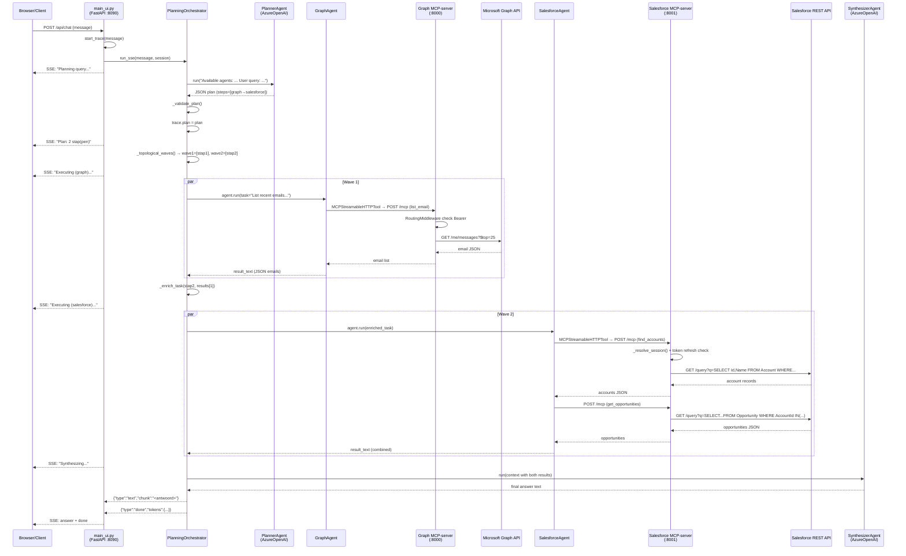

# Analysis 08 — End-to-end queryflow

## 1. Volledige stap-voor-stap beschrijving van één query

De flow wordt hier beschreven voor de vraag: **"Welke bedrijven heb ik onlangs gemaild en hoeveel open opportunities hebben die in Salesforce?"**

Deze vraag triggert een tweelaags plan: `graph` (e-mailhistorie) → `salesforce` (opportunities, afhankelijk van resultaat stap 1).

---

### Fase 0: Startup / initialisatie (eenmalig, niet per query)

**`main_ui.py`, functie `_setup_sync()` (regels 158–216)**

1. `configparser` leest `config.cfg`: Azure-clientId, tenantId, MCP-server URLs
2. `authenticate()` (`startup.py`, regels 43–98): MSAL `ConfidentialClientApplication` →
   - Probeert `acquire_token_silent()` met de `.token_cache.bin`-cache (10-seconden timeout)
   - Bij cache-miss: browser-redirect naar Microsoft login + callback-server op poort 5001
   - Retourneert access_token (Bearer)
3. Als MCP-URL lokaal: `_start_graph_mcp_server()` → `subprocess.Popen([sys.executable, "-m", "graph.mcp_server"])` + `_wait_for_port(host, 8000, timeout=15.0)`
4. `_resolve_sf_session()`: GET `/auth/salesforce/session`; bij 404: browser-redirect naar Salesforce OAuth + polling (max 120s)
5. `_resolve_ss_session()`: GET `/auth/smartsales/session`; auto-auth van env-vars (max 30s)
6. Lifespan: `httpx.AsyncClient` met Bearer header aangemaakt per MCP-server; `MCPStreamableHTTPTool` wrapt de client; agents aangemaakt

---

### Fase 1: HTTP-request ontvangen (`main_ui.py`)

**`POST /api/chat`** (regel 127–148) ontvangt `{"session_id": "...", "message": "Welke bedrijven..."}`:

```python
async def chat(body: ChatRequest):
    session = _sessions.get(body.session_id)
    start_trace(body.message)                     # RoutingTrace aangemaakt in ContextVar
    async for event in _orchestrator.run_sse(body.message, session=session):
        yield _sse(event)
    return StreamingResponse(generate(), media_type="text/event-stream")
```

- `start_trace()` (`agents/routing_trace.py`, regel 71–79): Nieuwe `RoutingTrace(user_query=...)` aangemaakt en gebonden aan de asyncio-context via `ContextVar.set()`
- `StreamingResponse` met `text/event-stream` media type; events worden geserializeerd als `data: {"type": ..., "chunk": ...}\n\n`

---

### Fase 2: Planning (`PlanningOrchestrator._create_plan()`, regels 289–324)

**Stap 2.1 — Agentbeschrijving samenstellen** (`_available_agents_description()`, regels 357–383):
```
graph (Microsoft 365: emails, ...), salesforce (CRM: accounts, ...), smartsales (locations, ...)
| For open-ended entity queries ... — use ALL agents.
```

**Stap 2.2 — LLM-aanroep (Planner)**:
```
prompt = "Available agents: <beschrijving>\n\nUser query: Welke bedrijven heb ik onlangs gemaild..."
resp = await self._planner.run(prompt, session=session)
```
Azure OpenAI deployment wordt aangeroepen. Resultaat is raw JSON (of met Markdown-fence, die wordt gestript).

**Stap 2.3 — JSON parsen en valideren**:
```json
{
  "query": "Welke bedrijven heb ik onlangs gemaild...",
  "reasoning": "First fetch email senders from Graph, then look up opportunities in Salesforce",
  "steps": [
    {"id": 1, "agent": "graph",       "task": "List recent emails and extract company names from sender addresses", "depends_on": []},
    {"id": 2, "agent": "salesforce",  "task": "Using company names from step 1, find open opportunities for those accounts", "depends_on": [1]}
  ],
  "synthesis": "Combine email contacts with their Salesforce opportunity pipeline"
}
```

`_validate_plan()` (regels 326–355): controleert dat alle agents in `valid_agents` zitten, dat elk step-schema compleet is.

**Yield**: `{"type": "text", "chunk": "Plan: 2 stap(pen)\n"}`

`trace.plan = plan` (regel 225)

---

### Fase 3: DAG-executie

**Stap 3.1 — Wave-berekening** (`_topological_waves()`, regels 387–422):
- Wave 1: `[stap 1 (graph)]` — geen depends_on
- Wave 2: `[stap 2 (salesforce)]` — depends_on=[1], wacht op wave 1

**Stap 3.2 — Wave 1 uitvoeren**:

```python
step_inputs = [(stap1, stap1["task"])]   # _enrich_task: geen afhankelijkheden
coros = [self._execute_step(stap1, task, session=session)]
wave_results = await asyncio.gather(*coros, return_exceptions=True)
```

**Binnen `_execute_step()` voor stap 1 (graph)**:
1. Agent-lookup: `{"graph": self._graph_agent}.get("graph")` → `graph_agent`
2. `started_at = datetime.now(timezone.utc).isoformat()`
3. `resp = await asyncio.wait_for(graph_agent.run(task, session=session), timeout=300.0)`

**Binnen `graph_agent.run()`** (agent_framework intern):
- Het LLM (`AzureOpenAIChatClient`) ontvangt de systemprompt van `graph_agent.py` + de taakomschrijving
- LLM-iteratie 1: besluit `list_email` aan te roepen (LLM kiest tool op basis van taakomschrijving)
- `MCPStreamableHTTPTool` stuurt MCP-request naar Graph MCP-server: `POST http://localhost:8000/mcp`

**Op de Graph MCP-server** (`graph/mcp_server.py`):
- `RoutingMiddleware`: controleert `Authorization: Bearer <token>`
- FastMCP dispatcht naar `list_email`-handler (`graph/mcp_router.py`, `_list_email()`)
- `_get_repo(token, azure_settings)` → `GraphRepository` (uit cache of nieuw)
- `await repo.get_inbox()` → Microsoft Graph SDK → `GET https://graph.microsoft.com/v1.0/me/messages?$top=25&$select=...`
- `_graph_call(coro, timeout=30.0)`: 30-seconden timeout
- Resultaat: list van `Email`-objecten → `[e.model_dump(mode="json") for e in emails]`
- MCP-response terug naar agent_framework

**LLM-iteratie 2** (optioneel): Als meer data nodig is (bijv. `search_email` voor specifieke afzenders), nog een tool-aanroep.

**Eindresultaat stap 1**: JSON-array met e-mailafzenders/bedrijfsnamen. `resp.text` bevat dit als string.

**Terug in `_execute_step()`**:
```python
for msg in resp.messages:
    if msg.role == "assistant": llm_turns += 1
    for content in msg.contents:
        if content.type == "function_call": tool_calls.append(content.name)
trace.invoked_agents.append(AgentInvocation(
    agent="graph", order=1, input=task,
    started_at=..., ended_at=..., success=True,
    llm_turns=2, tool_calls=["list_email"]
))
```

**Yield**: `{"type": "text", "chunk": "Executing (graph)...\n"}`

**Stap 3.3 — Wave 2 uitvoeren**:

`_enrich_task()` (regels 424–437) injecteert resultaat van stap 1:
```
[Result from step 1]:
[{"from": {"emailAddress": {"address": "john@acme.com", "name": "John Smith"}}, ...}]

[Task]:
Using company names from step 1, find open opportunities for those accounts
```

**Binnen `salesforce_agent.run()`**:
- LLM-iteratie 1: besluit `find_accounts` aan te roepen met bedrijfsnamen uit stap 1
- MCP-request naar Salesforce MCP-server (`http://localhost:8001/mcp`)

**Op de Salesforce MCP-server** (`salesforce/mcp_server.py`):
- `extract_session_token()` → `_resolve_session(session_token)`: controleert token vervaldatum + refresh
- `SalesforceRepository.get_accounts(name="ACME", ...)` → SOQL-query:
  `SELECT Id, Name, Industry FROM Account WHERE Name LIKE 'ACME%' LIMIT 25`
- `GET {instance_url}/services/data/v59.0/query?q=...` (timeout: 30s)

- LLM-iteratie 2: gebruikt Account-IDs om `get_opportunities` aan te roepen
  `SELECT Id, Name, StageName, Amount FROM Opportunity WHERE AccountId IN (...) AND IsClosed = false LIMIT 25`

---

### Fase 4: Synthese (`PlanningOrchestrator._synthesize()`, regels 510–534)

**Yield**: `{"type": "text", "chunk": "Synthesizing...\n"}`

Synthesizer-context:
```
User query: Welke bedrijven heb ik onlangs gemaild...
Synthesis instruction: Combine email contacts with their Salesforce opportunity pipeline
Step results:
[Step 1 — graph]:
[{"from": ..., "subject": ...}, ...]
[Step 2 — salesforce]:
[{"id": "...", "name": "ACME Corp", "opportunities": [...]}]
```

`resp = await self._synthesizer.run(context, session=session)` → antwoord van synthesizer LLM.

**Yield**: `{"type": "text", "chunk": "<eindantwoord>"}` gevolgd door `{"type": "done", "tokens": {...}}`

---

## 2. Mermaid-sequentiediagram



---

## 3. Foutafhandeling per fase

### Planningsfase

**JSON-parsefout**: `_create_plan()` (regels 296–323) probeert maximaal 2 keer. Bij aanhoudende mislukkng:
```python
except Exception as exc:
    yield {"type": "error", "message": f"Planning failed: {exc}"}
    return
```
De generator stopt; geen stappen worden uitgevoerd.

**Markdown-fence aanwezig**: Automatisch gestript (regels 306–313).

**Ongeldig schema**: `_validate_plan()` gooit `ValueError` → wordt gevangen door `_create_plan()`'s tweede poging.

### Uitvoeringsfase

**Timeout**: `asyncio.wait_for(..., timeout=300.0)` → `asyncio.TimeoutError` wordt omgezet naar `TimeoutError` met bericht (regel 461).

**Content filter**: Azure content filter triggert `ContentFilter`-exception → afgevangen (regels 465–468):
```python
if "content_filter" in str(exc) or "ContentFilter" in type(exc).__name__:
    result_text = "[Resultaat geblokkeerd door Azure content filter...]"
    return result_text
```
De stap retourneert een vaste tekst; de rest van de pipeline gaat door.

**Agent-niet-gevonden**: `ValueError: Agent 'xyz' is not available` → via `asyncio.gather(return_exceptions=True)` gevangen en als `BaseException` gedetecteerd (regels 255–262):
```python
if isinstance(res, BaseException):
    yield {"type": "error", "message": f"Step {step['id']} ({step['agent']}) failed: {err_msg}"}
    continue
```
Overige stappen in de wave worden gewoon verwerkt; de run gaat door.

**Subagent-API fout** (bijv. Graph 403, Salesforce 401): De subagent-LLM ontvangt de foutmelding van de MCP-server als tool-resultaat en retourneert een tekst-antwoord met de foutsituatie. Er is geen centrale interceptie; de fout is zichtbaar in het syntheseresultaat.

**Circulaire afhankelijkheid**: `_topological_waves()` (regel 408) gooit `ValueError: Circular dependency detected` → gefangen in `run_sse()` (regel 236):
```python
except ValueError as exc:
    yield {"type": "error", "message": str(exc)}
    return
```

**Verbindingsfout MCP-server**: `MCPStreamableHTTPTool` via `httpx` → `httpx.ConnectError` of `httpx.TimeoutException` → propagateert als exception in `agent.run()` → gevangen door `_execute_step()`'s exception-handler.

### Synthesefase

**Synthesizer-fout**:
```python
except Exception as exc:
    yield {"type": "error", "message": f"Synthesis failed: {exc}"}
    return
```

### RoutingTrace-fout

`get_trace()` controleert op `None` voor elke `trace.invoked_agents.append()` (regel 494–506). Als er geen actieve trace is (bijv. bij direct subagent-gebruik in evaluatie), wordt de trace-logging overgeslagen zonder exception.

---

## 4. Token- en latency-accounting

**Tokenaccumulatie** (`_accumulate_usage()`, regels 195–199):
```python
self._input_tokens  += usage.get("input_token_count",  0) or 0
self._output_tokens += usage.get("output_token_count", 0) or 0
```
Aangeroepen na:
- `_planner.run()` (regel 299)
- `_synthesizer.run()` (regel 527 via `_accumulate_usage`)
- `agent.run()` in `_execute_step()` (regel 470)

Cumulatieve tellers worden gereset bij het begin van elke `run_sse()` aanroep (regels 211–212).

**SSE `done`-event** (regels 277–285):
```python
yield {"type": "done", "tokens": {"input": self._input_tokens, "output": self._output_tokens, "total": total}}
```

**Latency**: Niet gemeten in `run_sse()`; gemeten door `run_and_collect()` in `mlflow_eval.py` via `time.monotonic()`.

---

## 5. Multi-turn geheugen (sessiecontext)

De `AgentSession` (`agent_framework`) houdt per sessie de berichten-geschiedenis bij. Bij elke nieuwe beurt in `run_sse()` wordt `session=session` doorgegeven aan alle agent-aanroepen, zodat de conversatiegeschiedenis bewaard blijft.

**DocumentContextProvider** (uitsluitend GraphAgent): vóór elke turn injecteert `before_run()` een `[Session Context]`-blok met het onderwerp, de laatste zoekopdracht en eerder gevonden bestands-ID's (zie `graph/context.py`, regels 24–49). Na elke turn bijwerkt `after_run()` de sessie-state.

Salesforce- en SmartSales-agents hebben geen `DocumentContextProvider`; hun geheugen beperkt zich tot de `AgentSession`-berichten-geschiedenis van `agent_framework`.

---

## 6. Bijzondere gevallen in de query flow

### GraphRAG-aanroep

Wanneer de GraphAgent `search_documents` aanroept (`graph/mcp_router.py`, regel 59–61):
1. MCP-handler delegeert naar `search_documents(query)` in `graphrag_searcher.py`
2. `asyncio.to_thread(_search_sync, query)`: synchrone code loopt in thread pool
3. Binnen `_search_sync()`:
   - `AzureOpenAI.embeddings.create(model="text-embedding-3-small", input=query)` (HTTP)
   - `vector_table.search(query_vector).limit(5).to_pandas()` (LanceDB, in-process)
   - `AzureOpenAI.chat.completions.create(...)` (HTTP, temperature=0)
4. Resultaat: `{"answer": "...", "sources": ["document1", "document2"]}`
5. Extra AzureOpenAI-aanroepen die NIET door `_accumulate_usage()` worden gevangen (ze verlopen via de synchrone `AzureOpenAI`-client, niet via `agent_framework`)

### Afhankelijke stap met lege parent

Wanneer stap 1 geen resultaten retourneert (bijv. geen recente e-mails), bevat de verrijkte taakstring:
```
[Result from step 1]:
[]

[Task]:
Using the account names from step 1 (if any), ...
```
De subagent ontvangt dit als context. De systemprompt instrueert om lege resultaten expliciet te melden en de afhankelijke zoekactie over te slaan.

### Gedeelde `AgentSession` bij parallelle stappen

`asyncio.gather()` voert stap 1 en stap 2 parallel uit maar met dezelfde `AgentSession`. Als `agent_framework` de sessie-state niet thread-safe bijwerkt, kunnen race conditions optreden. In de geobserveerde code wordt de sessie niet gesplitst per stap; dit is een potentieel knelpunt bij parallelle stappen die naar dezelfde agent gaan (twee stappen naar `graph` tegelijk).
